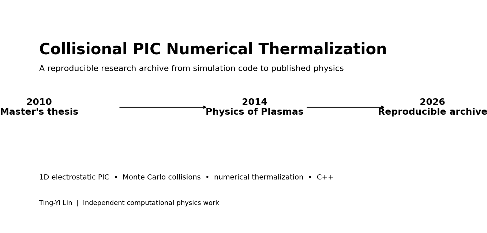

# Collisional PIC Numerical Thermalization

**Recovered and validated 1D electrostatic Particle-in-Cell (PIC) research code from my 2010 master's thesis, linked to our later 2014 _Physics of Plasmas_ paper.**



## Why this repository exists

This repository preserves the computational research chain behind my plasma-physics master's work: physical model → numerical implementation → simulation → analysis → later peer-reviewed publication. It is a historical research artifact with a modern validation wrapper, not a new general-purpose PIC framework.

The C++ simulation program was independently developed by **Ting-Yi Lin** for the master's research by implementing and combining numerical methods described in textbooks and published literature. No third-party program source code was copied into the simulation.

## Research lineage

- **2010 — Master's thesis:** _Kinetic Properties of the Particle-in-Cell Simulation of one dimensional Lorentz Plasmas_ (National Central University).
  - Thesis record: https://ir.lib.ncu.edu.tw/handle/987654321/25772
- **2014 — Journal paper:** P. Y. Lai, T. Y. Lin, Y. R. Lin-Liu, and S. H. Chen, “Numerical thermalization in particle-in-cell simulations with Monte-Carlo collisions,” _Physics of Plasmas_ **21**, 122111 (2014).
  - DOI: https://doi.org/10.1063/1.4904307

## Validation status

**VALIDATED AGAINST THESIS RESULTS.**

The restored program compiles and runs in a modern environment. Representative reruns reproduce the main thesis trends and mechanisms, including the reduction of numerical thermalization time when pitch-angle Monte-Carlo collisions are added. No material contradiction with the thesis's core conclusions was identified.

For thesis validation, `collision_alpha=3` is used as specified in thesis Sec. 2.3. The code is parameterized; the Appendix-B example input is not a statement that every thesis figure used the same input. The publication validation preset also uses first-order weighting as described in Sec. 3.1.

This is **not** a claim of exact point-by-point or bitwise reproduction of every historical random realization, and it is not a full replication of the later 2014 paper.

## One-click thesis validation

Windows:

```bat
validate_thesis.bat
```

Linux/macOS:

```bash
./validate_thesis.sh
```

The validator compiles the recovered source and runs representative collisionless/collisional cases. It uses the portfolio protocol agreed for this archive: **3 repetitions by default, 5 only if stochastic variability makes the result ambiguous**. A successful run prints `THESIS_VALIDATION_PASS`.

## Repository map

```text
src/pic_2010_recovered.cpp             recovered historical C++ source
config/thesis_validation_input.txt      thesis-era parameter preset (alpha=3)
config/validation_quick_*.txt           one-click representative cases
scripts/thesis_validation.py            compile + representative validation
validation/VALIDATION.md                 validation scope and evidence
docs/PARAMETER_NOTE.md                   parameter provenance
assets/                                  original repository graphics
```

## Quick build/smoke check

```bash
python scripts/smoke_test.py
```

## Scope

The goal is preservation and verification of the original computational work. The repository does not redistribute the publisher PDF or the thesis PDF.
